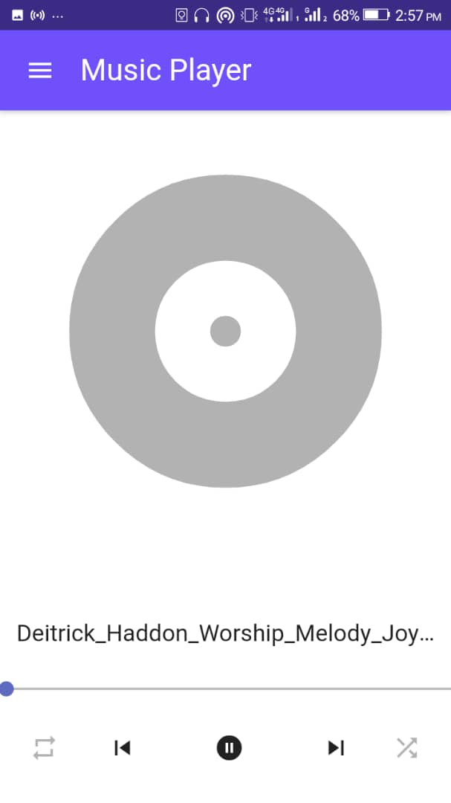
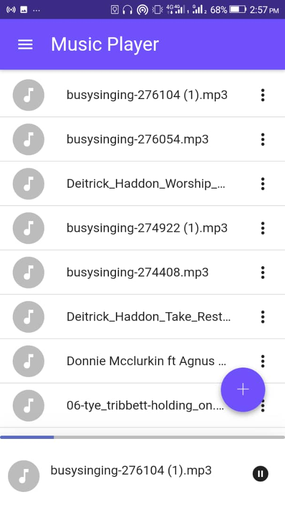
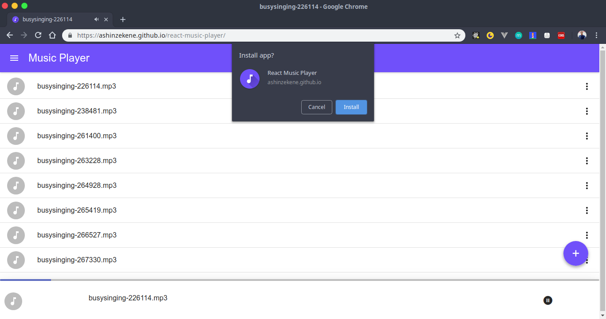
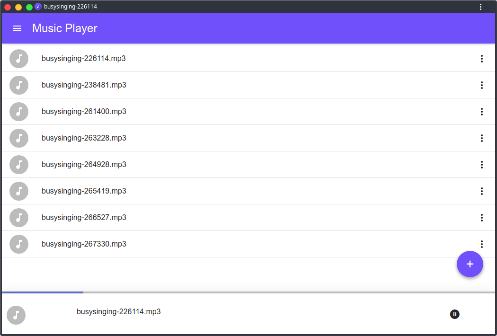

# MUSIC PLAYER

 A react music player PWA that plays local files using the Files API

 [CHECK OUT THE WEB APP](https://ashinzekene.github.io/react-music-player)

  
  
  
  
 
## CONTRIBUTING

Feel free to contribute to the repo. Make sure you configure eslint, or run lint before submitting pull requests
### TECH STACK
- React
- Redux

## Features
1. Play/Pause
1. Repeat Options
1. Progress Bar
1. Drag and Drop - Thanks to [@CliffReimers](https://github.com/CliffReimers)
1. Keyborad Controls - Thanks to [@Spring3](https://github.com/Spring3)

## TODO LIST

1. Play Next Automatically ✅
1. Controls - Next, Previous, Progress Bar ✅
1. Saving Songs(localStroage) ✅
1. UI ✅
1. A Page for currently playing song ✅
1. Host on GitHub ✅
1. Repeat ✅
1. Seek progressbar on nowPlayingPage ✅
1. Let playing song show as playing
1. Add Icons to sidebar
1. Show Time
1. Use the MediaAPI
1. Fix linting
1. Shuffle
1. Search
1. Playlists

## BUGS

1. Pauses on state change ✅
  > Was due to the fact the audio element was in a child component which unmounts
  > was resolved by moving the audio element to a component that does not unmount